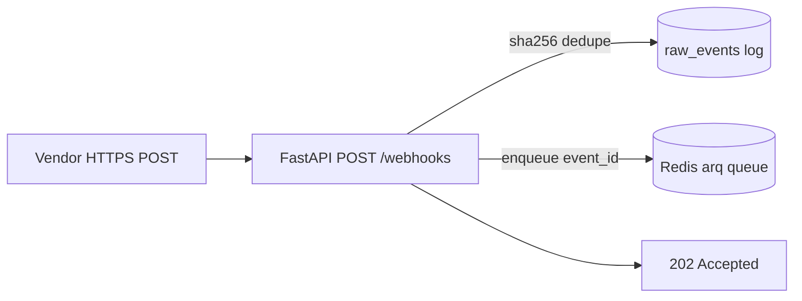
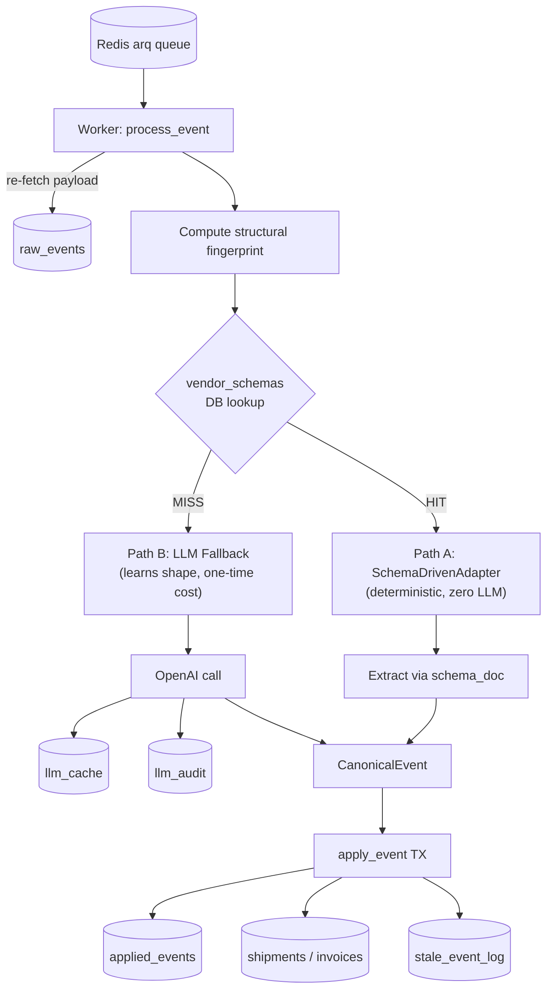

# AI Webhook Ingestion & Normalization Service

## Problem statement

Vendors push webhooks of arbitrary shape — Maersk shipment milestones, GlobalFreightPay invoices in mixed currencies and locales, ONE delivery confirmations with regional timezones, marine traffic advisories with no business identity at all. The system must:

- accept any JSON payload at `POST /webhooks` and acknowledge in sub-second,
- classify it as **shipment**, **invoice**, or **unclassified**,
- normalize it into a strict canonical schema using deterministic adapters where possible and an LLM as fallback,
- project it onto entity state machines that survive duplicates, retries, out-of-order delivery, and replay,
- be **deterministic despite using an LLM** — same payload → same canonical event, every time.

LLMs are treated like any expensive non-deterministic external API: a fallback for unknown vendor shapes, gated by cache + budget + JSON-schema validation + audit. Known vendor shapes are handled deterministically via DB-stored schemas (zero LLM cost). Unknown shapes trigger a single LLM call that teaches the system the new shape — all future events from the same vendor+shape are then handled deterministically.

---

## Architecture

The system is split into two planes with different SLOs:

### Plane 1 — Ingestion (synchronous, sub-second)



Hot path is intentionally thin: read body → size/JSON check → `sha256(canonical_json(payload))` → `INSERT raw_events ON CONFLICT DO NOTHING` → enqueue → `202`. No LLM, no joins, no business logic. The `event_id` is content-addressed (derived from the payload), so vendor retries are a free no-op.

### Plane 2 — Processing (async worker, learn-once architecture)



**Two-path flow:**

- **Path A (known shape, deterministic):** Structural fingerprint → `vendor_schemas` DB lookup → `SchemaDrivenAdapter` executes a declarative `schema_doc` against the payload → event type classified via `vendor_event_type_map` (or one-time LLM Prompt B if new) → `CanonicalEvent`. Zero LLM cost in steady state.
- **Path B (unknown shape, learns once):** LLM fallback extracts the event, then **Schema Discovery** reverse-maps the extracted values back to payload paths, infers a `schema_doc`, validates it, and persists it to `vendor_schemas`. All future events with the same fingerprint graduate to Path A permanently.

**Key insight:** The system starts expensive (every new vendor shape hits the LLM once) and converges to zero LLM cost as shapes are learned. A vendor sending 10,000 events/day with a stable schema pays for 1 LLM call ever.

### State machine

Inside one Postgres transaction: `SELECT FOR UPDATE` → `INSERT applied_events ON CONFLICT DO NOTHING` (idempotency) → timestamp guard (stale events never walk state backward) → allowed-transition check → update projection.

---

## Data model

| Table | Purpose |
|-------|---------|
| `raw_events` | Immutable append-only log of every payload received |
| `vendor_schemas` | Learned extraction schemas per (vendor, structural_fingerprint) |
| `vendor_event_type_map` | Permanent cache: (vendor, raw_event_type) → (classification, state) |
| `canonical_events` | Normalized events post-extraction |
| `applied_events` | Which events moved which entity's state (idempotency PK) |
| `shipments` / `invoices` | Projection tables (current state of each entity) |
| `stale_event_log` | Out-of-order events that arrived too late |
| `llm_cache` / `llm_audit` | LLM call cache and audit trail |

---

## Stack

FastAPI · Postgres 16 (`asyncpg`) · Redis 7 (`arq`) · Pydantic v2 · `structlog` · Prometheus client · OpenAI (GPT-4o-mini, fallback path only).

---

## Run it

```bash
make up        # postgres, redis, api, worker; auto-migrates
make seed      # POST the 6 appendix payloads
make test      # full suite (e2e tests skip if DB is unreachable)
```

Set `OPENAI_API_KEY` in `.env` for the LLM fallback path (unknown vendor shapes). Known shapes are handled deterministically via `vendor_schemas` — no LLM calls required.

---

## Essential metrics

Exposed at `/metrics`, defined in [`app/metrics.py`](app/metrics.py).

| Metric | Type | Labels | What it answers |
|---|---|---|---|
| `webhook_ingest_total` | counter | `vendor`, `result` | Ingest QPS, dedupe rate. |
| `webhook_ingest_latency_seconds` | histogram | `vendor` | Receiver p50/p95/p99 ack latency. SLO: p99 < 250ms. |
| `webhook_worker_processed_total` | counter | `vendor`, `classification`, `outcome` | Worker throughput; outcome includes applied, idempotent, stale, rejected, llm_failed, error. |
| `webhook_worker_latency_seconds` | histogram | `vendor`, `classification` | End-to-end normalization latency. |
| `llm_calls_total` | counter | `provider`, `model`, `decision` | LLM call volume; decision includes cache_hit, success, validation_retry, validation_failed, budget_exceeded. |
| `llm_tokens_total` / `llm_cost_estimate_usd_total` | counter | `provider`, `model`, `direction` | Spend, broken down by direction (in/out). |
| `state_transition_total` | counter | `entity_type`, `outcome` | Transitions vs stale_skipped vs disallowed_transition. |

Plus structured JSON logs with `trace_id` propagated receiver → queue → worker → state transition, and `/healthz` (liveness) + `/readyz` (DB + Redis ping).

---

## Architectural decisions

**Content-addressed dedupe.** `event_id = sha256(canonical_json(payload))`. Sorted-keys, separator-tight JSON makes the hash invariant to whitespace and key order. PK on `raw_events.event_id` + `ON CONFLICT DO NOTHING` makes vendor retries a free no-op. The dedupe key is *derived*, not generated — survives across processes, restarts, and replays.

**Structural fingerprinting for schema identity.** SHA-256 of sorted `(json_path, leaf_type)` set. Values are ignored — only the shape matters. Same vendor+shape → same fingerprint → same schema_doc → deterministic extraction. Handles arrays (union of element types), nested objects, and configurable map-paths for dynamic-key dictionaries.

**DB-driven schema registry over hardcoded adapters.** `vendor_schemas` table stores declarative `schema_doc` JSONB per (vendor_id, structural_fingerprint). A `SchemaDrivenAdapter` executes the schema_doc as a pure function — no per-vendor code needed. New vendors are onboarded by learning their schema once (via LLM or manual entry), not by writing code.

**LLM as one-time teacher, not runtime dependency.** The LLM is only invoked for genuinely new shapes (Path B). Once a shape is learned, all future events with that fingerprint use Path A (zero LLM cost). The LLM is gated by: cache lookup → budget guard → OpenAI call at temperature=0 → jsonschema validation → one self-correcting retry → audit row.

**LLM-based event type classifier (Prompt B).** When a new `raw_event_type` string is encountered, a lightweight LLM prompt classifies it into `(classification, canonical_state, confidence)`. The result is persisted to `vendor_event_type_map` permanently — each unique `(vendor_id, raw_event_type)` pair costs one tiny LLM call (~40 tokens, <$0.0002) and is never called again.

**State machine: idempotency + out-of-order at write time.** `applied_events(entity_id, event_id)` PK is the hard guarantee that no event moves state twice. Timestamp guard prevents a later-arriving older event from walking state backward. Initial state `None` is intentionally permissive — a backfilled vendor's first event can be any non-terminal state.

**Replay is the regression test.** [`app/tools/replay.py`](app/tools/replay.py) re-runs events from `raw_events` through the *same* `process_event` pipeline — no special code path. The byte-identical-projection invariant is asserted in tests.

---

## Trade-offs given time

Conscious choices to fit the assessment window:

- **Event type classification via LLM (Prompt B).** When `vendor_event_type_map` misses, a lightweight LLM call (~40 tokens in, ~20 out, <$0.0002) classifies the raw event type string. The result is persisted permanently — each unique `(vendor, event_type)` pair triggers exactly one LLM call ever.
- **Schema Discovery produces `provisional` schemas.** Inferred schemas are immediately usable but not yet validated against multiple events. Production should run a comparison pipeline (LLM vs SchemaDrivenAdapter) for the first K events before promoting to `active`.
- **arq on Redis instead of Kafka/SQS.** Keeps local dev to one `docker compose up`. The worker contract is "give me an event_id" — swappable.
- **No transactional outbox.** The architecture supports adding one without changing the state machine's TX shape.
- **Daily budget guard via Postgres aggregation.** Correct across processes; production should use Redis token buckets.
- **No multi-tenancy.** Single global namespace; production needs `org_id` + RLS.
- **Fingerprint fragmentation accepted.** Optional fields produce distinct fingerprints (each costs one Path B call). Merge CLI handles ops overhead. Alternative (fuzzy matching) risks false schema reuse — worse failure mode.
- **Migrations are flat SQL files** with a tiny `schema_migrations` table.

---

## Production roadmap

In rough priority order:

1. **Provisional → active schema promotion.** Compare LLM output vs SchemaDrivenAdapter for first K events; promote to `active` on agreement, deprecate on divergence.
4. **Per-vendor signature verification** with KMS-backed secrets and vendor-specific formats.
5. **Multi-tenancy + RLS.** `org_id` on every business table, per-tenant LLM budgets.
6. **Real downstream sinks.** Transactional outbox + dispatcher for HTTP/SQS/Kafka consumers.
7. **Cost & quality dashboards.** LLM spend, cache-hit rate, stale-event rate, human-review rate.
8. **Partitioned `raw_events`** by `received_at` weekly, archived to object storage after 90 days.
9. **Blue/green replay.** Replay into parallel projection schema, diff vs production, swap atomically.
10. **DLQ inspector UI.** Human-in-the-loop for `requires_human_review`, with one-click replay.
