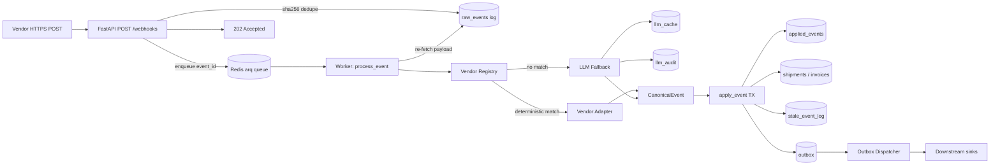

# AI Webhook Ingestion & Normalization Service

## Problem statement

Vendors push webhooks of arbitrary shape — Maersk shipment milestones, GlobalFreightPay invoices in mixed currencies and locales, ONE delivery confirmations with regional timezones, marine traffic advisories with no business identity at all. The system must:

- accept any JSON payload at `POST /webhooks` and acknowledge in sub-second,
- classify it as **shipment**, **invoice**, or **unclassified**,
- normalize it into a strict canonical schema using deterministic adapters where possible and an LLM as fallback,
- project it onto entity state machines that survive duplicates, retries, out-of-order delivery, and replay,
- be **deterministic despite using an LLM** — same payload → same canonical event, every time.

LLMs are treated like any expensive non-deterministic external API: a fallback, gated by cache + budget + JSON-schema validation + audit, never the default. The provider is pluggable; an offline deterministic stub is the default so the system runs end-to-end with no API key.

---

## Architecture



The hot path (HTTP receiver) does only: parse JSON → `sha256` → `INSERT raw_events ON CONFLICT DO NOTHING` → enqueue → `202`. No LLM, no joins, no business logic. Everything else — classification, normalization, state transitions, side-effects — runs in workers consuming a Redis queue. State is a pure projection of the immutable `raw_events` log and is rebuildable via the replay CLI.

**Stack:** FastAPI · Postgres 16 (`asyncpg`) · Redis 7 (`arq`) · Pydantic v2 · `structlog` · Prometheus client.

**Run it:**

```bash
make up        # postgres, redis, api, worker, dispatcher; auto-migrates
make seed      # POST the 6 appendix payloads
make test      # full suite (e2e tests skip if DB is unreachable)
```

Default `LLM_PROVIDER=stub` requires no API key. Set `LLM_PROVIDER=openai` + `OPENAI_API_KEY` in `.env` to flip to OpenAI Structured Outputs.

---

## Essential metrics

Exposed at `/metrics`, defined in [`app/metrics.py`](app/metrics.py).

| Metric | Type | Labels | What it answers |
|---|---|---|---|
| `webhook_ingest_total` | counter | `vendor`, `result` | Ingest QPS, dedupe rate. |
| `webhook_ingest_latency_seconds` | histogram | `vendor` | Receiver p50/p95/p99 ack latency. SLO: p99 < 250ms. |
| `webhook_worker_processed_total` | counter | `vendor`, `classification`, `outcome` | Worker throughput; outcome ∈ {applied, idempotent, stale, rejected, llm_failed, error}. |
| `webhook_worker_latency_seconds` | histogram | `vendor`, `classification` | End-to-end normalization latency. |
| `llm_calls_total` | counter | `provider`, `model`, `decision` | LLM call volume; decision ∈ {cache_hit, success, validation_retry, validation_failed, budget_exceeded}. |
| `llm_tokens_total` / `llm_cost_estimate_usd_total` | counter | `provider`, `model`, `direction` | Spend, broken down by direction (in/out). |
| `state_transition_total` | counter | `entity_type`, `outcome` | Transitions vs `stale_skipped` vs `disallowed_transition`. |
| `outbox_dispatched_total` | counter | `kind`, `outcome` | Downstream delivery; outcome ∈ {sent, retried, dlq}. |

Plus structured JSON logs with a `trace_id` propagated `receiver → queue → worker → state transition → outbox`, and `/healthz` (liveness) + `/readyz` (DB + Redis ping).

---

## Architectural decisions

**Content-addressed dedupe.** `event_id = sha256(canonical_json(payload))`. Sorted-keys, separator-tight JSON makes the hash invariant to whitespace and key order. PK on `raw_events.event_id` + `ON CONFLICT DO NOTHING` makes vendor retries a free no-op — the receiver returns `deduplicated: true` and does not enqueue a second job. The dedupe key is *derived*, not generated, which means it survives across processes, restarts, and replays.

**Deterministic adapter first, LLM as fallback.** A vendor registry fingerprints the payload and routes to a thin pure-function adapter ([Maersk, ONE, GlobalFreightPay, MarineTraffic](app/adapters/)) when one matches; otherwise to `LLMUniversalAdapter`. Production teams pay 100–1000× per LLM call vs deterministic code, so the architecture is designed to keep LLM usage on the long tail. Cache by `(prompt_version, payload_hash, schema_version)` means the second delivery of any new vendor shape is free; once a shape is stable you write a thin adapter and graduate it off the LLM entirely.

**LLM gated by cache, budget, schema, audit.** [`app/llm/fallback.py`](app/llm/fallback.py): cache lookup before any network call (cache hits still write an audit row); per-vendor and global daily budget guard that raises `BudgetExceeded` so events are marked `pending_llm`, not silently dropped; `jsonschema` validation against [`v1_target_schema.json`](app/llm/schemas/v1_target_schema.json) with **exactly one** self-correcting retry — then `requires_human_review`, no partial writes; temperature 0; one `llm_audit` row per call recording tokens, latency, cost, decision. Prompt and schema are versioned so a bump invalidates cache cleanly.

**Pluggable provider, offline default.** `LLMProvider` is a Protocol. `StubLLM` is a deterministic key-free implementation that uses the same fingerprints the deterministic adapters use plus broader keyword classification, so the system runs end-to-end with no API key. `OpenAILLM` wraps chat-completions with `response_format=json_schema` and reports real token cost. One env var swaps them.

**State machine: idempotency + out-of-order, both at write time.** [`app/domain/state_machine.py`](app/domain/state_machine.py) inside one transaction: `SELECT ... FOR UPDATE` on the projection row, `INSERT INTO applied_events ON CONFLICT (entity_id, event_id) DO NOTHING RETURNING` (returns nothing on duplicate → `already_applied`), validate against `ALLOWED_TRANSITIONS`, compare `incoming.event_timestamp` vs current `state_timestamp` (older → `stale_event_log`, never walks backward), update projection, write outbox row, commit. The `applied_events` PK is the hard guarantee that no event moves state twice. Initial state is `None`, intentionally permissive (a backfilled vendor's first event might be `IN_TRANSIT`); the timestamp guard prevents a later-arriving older event from undoing it.

**Transactional outbox + dispatcher.** State transitions write to `outbox` in the **same DB transaction** as the projection update, so we never have "decided X but didn't tell the world". A separate dispatcher pops rows with `FOR UPDATE SKIP LOCKED`, calls a downstream sink with `idempotency_key = event_id:kind`, retries with exponential backoff, DLQs after N attempts. End-to-end exactly-once if downstreams respect the idempotency key.

**Replay is the regression test.** [`app/tools/replay.py`](app/tools/replay.py) re-runs events from `raw_events` through the *normal* worker pipeline — no special replay code path. With `--truncate-projections`, the entire state is rebuilt from the log; the byte-identical-projection invariant is asserted in [`tests/test_replay.py`](tests/test_replay.py).

---

## Trade-offs given time

Conscious choices to fit the assessment window:

- **Single `POST /webhooks` endpoint, vendor inferred in the worker.** Spec says "any arbitrary JSON", so vendor identity is derived from the payload by `AdapterRegistry`. A `POST /webhooks/{vendor_id}` route exists for vendor-scoped verification and routing.
- **HMAC signature verification is a hook, not enforced.** `WEBHOOK_VENDOR_SECRETS` toggles HMAC verification on vendor-scoped routes; production still needs KMS-backed secrets, rotation, and per-vendor signature formats (Stripe-style, GitHub-style, etc.).
- **arq on Redis instead of Kafka/SQS.** Keeps local dev to one `docker compose up`. Migration to Kafka/SQS is a small change in [`app/queue.py`](app/queue.py); the worker contract is "give me an event_id".
- **Outbox dispatcher's downstream is a logging stub** behind the `DownstreamSink` interface. Production would inject a real HTTP/SQS/Kafka client behind the same interface.
- **Daily budget guard via Postgres aggregation.** Correct across processes and good enough for the demo; production should use Redis token buckets or a dedicated quota service to avoid cross-process race conditions and DB pressure.
- **One self-correcting retry on schema-invalid LLM output.** Not N with backoff — once is the SLA, then human review. The cost/latency profile is intentional; tune up if production data shows it's worth it.
- **Four deterministic adapters.** A real fleet has dozens; the architecture supports adding them incrementally as vendors graduate from "rare" (LLM-handled) to "frequent" (adapter-handled), without changing the worker.
- **No multi-tenancy.** Single global namespace; production needs `org_id` on every business table and row-level security.
- **PII handling = "don't log payloads".** No structured PII redaction; production needs a structlog processor that scrubs a configurable set of fields.
- **Migrations are flat SQL files** with a tiny `schema_migrations` table. Production wants Alembic/Atlas with safe-by-default DDL and a real migration tool.

---

## Production roadmap

In rough priority order:

1. **Per-vendor signature verification** on `POST /webhooks/{vendor_id}`, secrets in a KMS, rotated, with vendor-specific signature formats.
2. **Schema registry** for canonical events; adapters declare `accepts: vendor_schema_v3, emits: canonical_v1` so old events replay correctly forever.
3. **Multi-tenancy + RLS.** `org_id` on every business table, per-tenant LLM budgets and rate limits.
4. **Real downstream sinks.** HTTP-with-retries, SQS, Kafka, internal services behind the existing `DownstreamSink` interface.
5. **Cost & quality dashboards.** Daily LLM spend by vendor/classification/model, cache-hit rate, stale-event rate, `requires_human_review` rate, transition-reject rate.
6. **Adapter promotion pipeline.** "Vendor X has been LLM-handled with stable JSON outputs for N days" → templated PR for a deterministic adapter.
7. **Partitioned `raw_events`** by `received_at` weekly, archived to object storage after 90 days; replay transparently re-hydrates from cold storage.
8. **Blue/green replay.** Replay into a parallel projection schema, diff vs production, swap atomically.
9. **Real budget service.** Redis-backed token buckets with burst, replacing the Postgres aggregation.
10. **DLQ inspector UI.** Human-in-the-loop tool for `requires_human_review` and outbox DLQ, with one-click replay.
