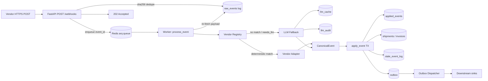

# AI Webhook Ingestion & Normalization Service

Production-shaped backend service that ingests vendor webhook payloads of any shape, classifies them as **shipment**, **invoice**, or **unclassified**, normalizes them into strict canonical schemas, projects them onto idempotent entity state machines, and persists everything into Postgres with a transactional outbox for downstream side-effects.

It treats LLMs the way you should treat any expensive non-deterministic external API: **as a fallback, not a default**. Deterministic vendor adapters do the work where they can; the LLM kicks in only when no adapter recognizes the payload (or when fields are missing) and its output is gated by cache + budget + JSON-schema validation + audit log.

A pluggable LLM provider abstraction means the system runs end-to-end **with no API keys** by default (an offline deterministic stub), and switches to OpenAI Structured Outputs by flipping one env var.

---

## Table of contents

- [The five non-negotiable principles](#the-five-non-negotiable-principles)
- [System diagram](#system-diagram)
- [Walkthrough against the appendix payloads](#walkthrough-against-the-appendix-payloads)
- [Design decisions](#design-decisions)
- [Storage layout](#storage-layout)
- [Idempotency, dedup, out-of-order](#idempotency-dedup-out-of-order)
- [LLM gating, caching, audit](#llm-gating-caching-audit)
- [Observability](#observability)
- [Project layout](#project-layout)
- [How to run](#how-to-run)
- [Testing](#testing)
- [Trade-offs given time](#trade-offs-given-time)
- [Production roadmap](#production-roadmap)

---

## The five non-negotiable principles

Every line of code in this repo serves these:

1. **Fast acknowledgment.** The HTTP handler does the bare minimum: parse JSON, hash it, `INSERT ... ON CONFLICT DO NOTHING`, enqueue, return `202`. No LLM, no joins, no business logic on the hot path. Receiver p99 ack target: < 250ms.
2. **Async processing.** Normalization, LLM calls, state transitions, side-effects all run in workers consuming a Redis queue. The HTTP layer never blocks on them.
3. **Event-driven design.** Every webhook is an immutable row in `raw_events`. Downstream state (`shipments`, `invoices`, `outbox`) is a **projection** of that log and is fully replayable from it. The replay CLI is the regression test.
4. **Idempotency first.** Vendors retry. Queues are at-least-once. Replays exist. Every insert and state transition is safe to apply N times. Dedupe keys are derived deterministically (`sha256` of canonical JSON), not generated.
5. **LLM as fallback, not default.** Deterministic vendor adapter → LLM fallback → human review. The LLM is gated by cache, per-vendor budget, JSON-schema validation, and a per-call audit row. Temperature 0. One self-correcting retry on schema failure, then human review.

These principles map onto the [Decision Flow](.cursor/skills/webhook-ingestion/SKILL.md) the team uses for any change in this code path.

---

## System diagram



---

## Walkthrough against the appendix payloads

The six sample payloads exercise every interesting code path:

| # | Payload | Vendor matched | Classification | Event type | Entity external id |
|---|---|---|---|---|---|
| 1 | Maersk vessel sailed | `MaerskV1Adapter` | shipment | `shipment.in_transit` | `MAEU240498712:MSKU7748112` |
| 2 | Maersk gate-in (earlier) | `MaerskV1Adapter` | shipment | `shipment.picked_up` | `MAEU240498712:MSKU7748112` |
| 3 | GlobalFreightPay settled | `GlobalFreightPayV1Adapter` | invoice | `invoice.paid` | `GFP-INV-2026-Q2-08821` |
| 4 | GlobalFreightPay raised (earlier) | `GlobalFreightPayV1Adapter` | invoice | `invoice.issued` | `GFP-INV-2026-Q2-08821` |
| 5 | Ocean Network Express delivered | `OneV1Adapter` | shipment | `shipment.delivered` | `ONEYJKTHKG2604113:TLLU2890442` |
| 6 | Marine traffic advisory | `MarineTrafficV1Adapter` | unclassified | — | — |

**Same-entity collapse.** The two Maersk payloads describe the same parcel (`MAEU240498712 + MSKU7748112`). The adapter chooses that composite as `entity_external_id` so both events land on the same `shipments` row. Likewise the two GFP payloads share `doc_ref = GFP-INV-2026-Q2-08821` and collapse onto one `invoices` row.

**Out-of-order handling.** If we receive #1 (vessel sailed, 2026-04-21) before #2 (gate-in, 2026-04-19), the state machine applies #1 to `IN_TRANSIT`, then sees #2's earlier timestamp and routes it to `stale_event_log` instead of walking the state backward to `PICKED_UP`. Same logic for invoice #3 then #4: PAID stands; ISSUED is logged as stale. Both cases are exercised in [`tests/test_pipeline.py`](tests/test_pipeline.py) and [`tests/test_state_machine.py`](tests/test_state_machine.py).

**Money parsing.** GFP sends `"EUR 24.350,75"` (European format). [`app/adapters/parsers.py`](app/adapters/parsers.py) handles it, US `"USD 1,234.56"`, currency symbols, and integer-only forms by detecting the decimal separator from the *last* punctuation occurrence and converting to integer minor units (cents). Stored as `currency text` + `amount_minor bigint` to avoid float drift.

**Timezone parsing.** ONE sends `"28/04/2026 09:42 WIB"`. The parser knows `WIB = UTC+7` and emits `2026-04-28T02:42:00+00:00`. ISO-8601 with offsets is the fast path; regional abbreviations are a small alias table.

**Marine traffic advisory.** Classifies as `unclassified` deterministically (no LLM call) because operational advisories have no shipment/invoice identity.

**Unknown shapes.** Any payload that doesn't fingerprint to one of the four vendor adapters falls through to [`LLMUniversalAdapter`](app/adapters/llm_universal.py), which calls [`LLMFallback`](app/llm/fallback.py) → provider → schema-validated extraction → canonical event.

---

## Design decisions

### One endpoint, vendor detected later

The assessment spec says the endpoint must accept "any arbitrary JSON". So the canonical endpoint is `POST /webhooks` (no vendor in the path), and vendor identity is derived in the **worker** by the adapter registry. A second `POST /webhooks/{vendor_id}` is available for vendor-specific routing and optional HMAC signature verification when a per-vendor secret is configured.

### Content-addressed dedupe

`event_id = sha256(canonical_json(payload) || vendor_event_id?)`. Sorted-keys, separator-tight JSON makes the hash invariant to whitespace and key order. The vendor's own event id (when present in headers or a known field) is mixed in so identical heartbeat payloads from the same vendor remain distinguishable across deliveries.

The PK `(event_id)` on `raw_events` plus `INSERT ... ON CONFLICT DO NOTHING` makes duplicates a free no-op — the receiver returns `202` with `deduplicated: true` and does not enqueue a second job.

### Deterministic-first, LLM as fallback

The assessment says "use an LLM to classify and normalize". I read that as: **the system must be capable of LLM-based normalization for arbitrary unknown shapes**, not "every event must hit a model". Production teams pay 100–1000× per LLM call vs deterministic code, so the architecture is designed to:

- ship a deterministic adapter per known vendor (sample: 4 included),
- route everything else through `LLMUniversalAdapter`,
- cache LLM outputs by `(prompt_version, payload_hash, schema_version)` so vendor retries cost zero LLM calls, and
- enforce a per-vendor and global token budget.

A new vendor is hot the first time we see it; by the second delivery it's already in `llm_cache` and free. As traffic stabilizes, you write a thin adapter and graduate the vendor off the LLM entirely.

### Pluggable LLM provider with offline default

`StubLLM` (`app/llm/stub.py`) is a deterministic, key-free provider that uses the same fingerprints the deterministic adapters use, plus broader keyword classification, to produce the canonical JSON output for unknown payloads. Reviewers can run the system end-to-end with no API key.

`OpenAILLM` (`app/llm/openai_provider.py`) wraps the chat-completions API with `response_format=json_schema` (Structured Outputs) and gives real per-call cost estimates from token usage. Selected via `LLM_PROVIDER=openai`.

### Outbox + dispatcher

State transitions write to `outbox` in the **same DB transaction** as the projection update. A separate dispatcher process pops outbox rows with `FOR UPDATE SKIP LOCKED`, calls a downstream sink with an `idempotency_key = event_id:kind`, and retries on transient errors with exponential backoff (DLQ after `OUTBOX_MAX_ATTEMPTS`). This decouples "we decided X" from "we told the world X" and gives end-to-end exactly-one delivery as long as the downstream respects the idempotency key.

### Replay CLI

[`app/tools/replay.py`](app/tools/replay.py) selects events by vendor / time range / entity from `raw_events` and re-runs them through the *normal* worker pipeline (no special replay code path). With `--truncate-projections`, it wipes shipments, invoices, applied_events, outbox, etc., and rebuilds them. The byte-identical-projection invariant is asserted in [`tests/test_replay.py`](tests/test_replay.py).

---

## Storage layout

See [`app/storage/migrations/001_init.sql`](app/storage/migrations/001_init.sql).

| Table | Role |
|---|---|
| `raw_events` | Append-only log. PK `event_id`. Source of truth. |
| `entities` | Universal entity registry: PK `id`, UNIQUE `(vendor_id, entity_type, external_id)`. |
| `shipments` / `invoices` | Projections. UNIQUE `(vendor_id, external_id)`. Optimistic version. |
| `applied_events` | Idempotency table. PK `(entity_id, event_id)`. The hard guarantee. |
| `stale_event_log` | Auditability for events that arrived but didn't move state. |
| `outbox` | Pending side-effects. PK `(event_id, kind)`. |
| `llm_cache` | Per-`(prompt_version, payload_hash, schema_version)` cached LLM outputs. |
| `llm_audit` | Per-call audit (tokens, latency, cost, decision). Cache hits also written. |
| `canonical_events` | One strict normalized canonical record per `event_id` (including unclassified). |
| `requires_human_review` | Events that failed both deterministic and LLM paths. |

All projections are **rebuildable** from `raw_events`.

---

## Idempotency, dedup, out-of-order

| Failure mode | Handling |
|---|---|
| Vendor retries the same payload | `raw_events` insert is a no-op via `ON CONFLICT (event_id) DO NOTHING`. Receiver returns `deduplicated: true`. |
| Queue redelivers the same job | Worker re-runs `process_event` → `apply_event` → `INSERT INTO applied_events ON CONFLICT DO NOTHING` returns `already_applied`. No duplicate state move, no duplicate outbox row. |
| Out-of-order: later state arrives first | Applied. Earlier-state event with older `event_timestamp` is logged in `stale_event_log` and skipped. |
| Out-of-order: backwards transition with newer timestamp | E.g., `DELIVERED → IN_TRANSIT`. Rejected against `ALLOWED_TRANSITIONS`, logged in `stale_event_log` as `disallowed_transition:...`. |
| Worker crashes mid-transaction | Single DB transaction rolls back; queue redelivers; idempotency table prevents double-apply. |
| Downstream sink errors | Outbox dispatcher retries with exponential backoff; DLQ after N attempts. The worker is never blocked by it. |
| Schema drift in vendor | Add `vendor_v2` adapter alongside `vendor_v1`. Old events still process via their original version. Then replay the affected slice. |

Concretely (see [`app/domain/state_machine.py`](app/domain/state_machine.py)):

```python
ALLOWED_TRANSITIONS["shipment"] = {
    None:               {PICKED_UP, IN_TRANSIT, OUT_FOR_DELIVERY, DELIVERED, EXCEPTION, CANCELLED},
    PICKED_UP:          {IN_TRANSIT, OUT_FOR_DELIVERY, DELIVERED, EXCEPTION, CANCELLED},
    IN_TRANSIT:         {OUT_FOR_DELIVERY, DELIVERED, EXCEPTION, CANCELLED},
    OUT_FOR_DELIVERY:   {DELIVERED, EXCEPTION},
    EXCEPTION:          {IN_TRANSIT, OUT_FOR_DELIVERY, DELIVERED, CANCELLED},
    DELIVERED:          set(),  # terminal
    CANCELLED:          set(),  # terminal
}

ALLOWED_TRANSITIONS["invoice"] = {
    None:    {ISSUED, PAID, VOIDED, REFUNDED},
    ISSUED:  {PAID, VOIDED},
    PAID:    {REFUNDED},
    VOIDED:  set(),
    REFUNDED: set(),
}
```

The `None` initial state is intentionally permissive: if the first event we see for a shipment is `IN_TRANSIT` (because the vendor backfilled mid-life or out-of-order delivery), we accept it. The timestamp guard ensures a later-arriving older event does not move us backwards.

---

## LLM gating, caching, audit

[`app/llm/fallback.py`](app/llm/fallback.py) implements every rule:

- **Cache before any network call.** Key: `sha256(prompt_version || canonical_payload || target_schema_version)`. Stored in `llm_cache` (Postgres). Cache hits still write an `llm_audit` row so cost and outcome are observable.
- **Budget guard.** Per-vendor and global daily caps from `LLM_PER_VENDOR_DAILY_BUDGET_USD` and `LLM_GLOBAL_DAILY_BUDGET_USD`. On exceed, raise `BudgetExceeded` so the caller marks the event `pending_llm` (not dropped, not partially written).
- **Structured output.** JSON schema in [`app/llm/schemas/v1_target_schema.json`](app/llm/schemas/v1_target_schema.json). Validated with `jsonschema`. On validation failure, exactly **one** self-correcting retry with the validation error appended to the prompt. Otherwise `LLMValidationError` → caller marks `requires_human_review`. **No partial writes** in the failure case.
- **Temperature 0.** Determinism over creativity.
- **Audit.** One `llm_audit` row per event_id per call, including cache hits. Records `model`, `prompt_version`, `tokens_in`, `tokens_out`, `latency_ms`, `cost_estimate`, `decision`. Auditable from the DB.

The prompt template is versioned ([`app/llm/prompts/v1_classify_extract.txt`](app/llm/prompts/v1_classify_extract.txt)). Bumping the version invalidates cache cleanly and lets you A/B old vs new outputs from `llm_audit`.

---

## Observability

- **Structured JSON logs** via `structlog`, with a `trace_id` propagated `receiver → queue payload → worker → state transition → outbox`. See [`app/logging.py`](app/logging.py).
- **Prometheus metrics** at `/metrics`, exposed by FastAPI. Counters/histograms cover ingest QPS + latency, worker outcomes by `(vendor, classification, outcome)`, LLM call/token counters, state-transition outcomes, and outbox dispatch outcomes. See [`app/metrics.py`](app/metrics.py).
- **Health endpoints**: `/healthz` (liveness), `/readyz` (DB + Redis pings).
- **No payloads at INFO**. Vendor payloads contain PII (consignee names, ports, refs) and would blow up the log bill at scale.

---

## Project layout

```text
app/
  api/receiver.py            # POST /webhooks hot path
  config.py                  # pydantic-settings
  db.py                      # asyncpg pool + jsonb codecs
  hashing.py                 # canonical JSON, content-addressed event_id
  logging.py                 # structlog + trace_id contextvar
  main.py                    # FastAPI app, /healthz, /readyz, /metrics
  metrics.py                 # Prometheus counters/histograms
  queue.py                   # arq pool + enqueue helpers
  adapters/
    base.py                  # AdapterResult, VendorAdapter Protocol
    parsers.py               # parse_money, parse_timestamp (pure)
    registry.py              # vendor sniffer / fingerprint matching
    maersk_v1.py
    one_v1.py
    globalfreightpay_v1.py
    marine_traffic_v1.py
    llm_universal.py         # LLM-backed fallback adapter
  domain/
    canonical.py             # Pydantic canonical event types + state enums
    state_machine.py         # ALLOWED_TRANSITIONS + apply_event (TX)
  llm/
    provider.py              # LLMProvider Protocol
    stub.py                  # offline deterministic stub (default)
    openai_provider.py       # OpenAI Structured Outputs
    fallback.py              # cache + budget + retry + audit
    prompts/v1_classify_extract.txt
    schemas/v1_target_schema.json
  storage/
    migrations/001_init.sql
  workers/
    processor.py             # arq WorkerSettings
    pipeline.py              # process_event (used by worker, replay, tests)
    outbox_dispatcher.py     # FOR UPDATE SKIP LOCKED loop
  tools/
    migrate.py               # `python -m app.tools.migrate`
    replay.py                # `python -m app.tools.replay`
    seed.py                  # POST appendix payloads to running API
tests/
  fixtures/payloads/         # the 6 appendix payloads
  test_adapters.py           # unit, no DB
  test_canonical.py          # unit, no DB
  test_hashing.py            # unit, no DB
  test_llm_stub.py           # unit, no DB
  test_parsers.py            # unit, no DB
  test_llm_fallback.py       # e2e: cache, retry, always-invalid
  test_outbox.py             # e2e: deliver / retry / DLQ
  test_pipeline.py           # e2e: appendix end-to-end + idempotency
  test_receiver.py           # e2e: hot path, dedup, vendor path
  test_replay.py             # e2e: byte-identical projection rebuild
  test_state_machine.py      # e2e: ALLOWED_TRANSITIONS, stale, idempotency
docker-compose.yml
Dockerfile
Makefile
pyproject.toml
.env.example
```

---

## How to run

### Quick start (Docker)

```bash
git clone <this repo>
cd gls-assessment

# Bring up postgres, redis, api, worker, dispatcher; runs migrations automatically.
make up

# In another terminal: post the six appendix payloads at the API.
make seed
# Watch what happened.
make logs
```

The default `LLM_PROVIDER=stub` runs everything with **no API key required**. To use OpenAI, copy `.env.example` to `.env`, set `LLM_PROVIDER=openai` and `OPENAI_API_KEY=...`, then `make up`.

### Local Python (no Docker)

```bash
make install          # pip install -e ".[dev]" into your venv
# Need postgres + redis running locally on default ports.
make migrate
make api              # uvicorn on :8000
# In separate terminals:
make worker
make dispatcher
make seed
```

### Endpoints

| Method | Path | Purpose |
|---|---|---|
| POST | `/webhooks` | Accept any JSON payload. Returns `{event_id, deduplicated, trace_id}`. |
| POST | `/webhooks/{vendor_id}` | Same, with vendor known up-front and optional signature verification hook. |
| GET | `/healthz` | Liveness. |
| GET | `/readyz` | DB + Redis ping. |
| GET | `/metrics` | Prometheus exposition. |

---

## Testing

```bash
# Unit tests only — no Postgres or Redis required.
make test-unit

# Full suite including DB-backed tests. Bring up Postgres + Redis first.
make up
make test
```

The test pyramid:

- 50+ pure unit tests for parsers, hashing, adapters, canonical models, LLM stub. **No infra required.**
- DB-backed e2e tests covering: receiver dedup, state-machine transitions/idempotency/stale handling, full pipeline against the appendix, outbox dispatch + retry + DLQ, LLM fallback (cache/retry/failure), replay byte-identical-projection regression.

E2e tests **skip automatically** if Postgres is unreachable, so `pytest` runs cleanly on any laptop.
Set `REQUIRE_E2E_DB=1` to fail fast instead of skipping when DB is unavailable.

### Replay

```bash
# Re-process all maersk events received in the last 24h.
make replay ARGS="--vendor maersk --since '2026-04-19' --mode inline"

# Full rebuild: wipe projections, replay everything from raw_events.
make replay ARGS="--truncate-projections --mode inline"
```

---

## Trade-offs given time

These are conscious choices that I would change for production:

- **Single endpoint `POST /webhooks`.** The spec says "any arbitrary JSON", so vendor identity is derived in the worker by `AdapterRegistry`. `POST /webhooks/{vendor_id}` is available for vendor-scoped verification and routing.
- **Signature verification is intentionally lightweight for assessment scope.** We support optional HMAC verification on vendor-scoped routes when `WEBHOOK_VENDOR_SECRETS` is configured; production still needs KMS-backed secret rotation and vendor-specific signature formats.
- **Deterministic adapters for 4 sample vendors.** A real fleet has dozens; we'd write thin adapters incrementally as vendors graduate from "rare" (LLM-handled) to "frequent" (adapter-handled). The architecture supports it without changing the worker.
- **arq (Redis) instead of Kafka/SQS.** arq keeps local dev to a single `docker compose up`. Migration to Kafka/SQS is a 50-line change in [`app/queue.py`](app/queue.py) — the worker contract is "give me an event_id".
- **Outbox dispatcher's downstream is a logging stub.** Production would inject a real HTTP/SQS/Kafka client behind the same `DownstreamSink` interface.
- **Daily budget guard via Postgres aggregation.** Correct across processes and good enough for the demo. Production should use Redis token buckets or a dedicated quota service.
- **One self-correcting retry on schema invalid.** Not N retries with backoff — once is the SLA, then human review.
- **No multi-tenancy.** A single global namespace; production needs `org_id` everywhere and row-level security.
- **No PII redaction in logs.** Payloads are kept out of logs entirely; production needs redaction at the structlog processor level for the few places we *do* log payload fragments.
- **Single migration file.** Simple `schema_migrations` table; production wants Alembic / Atlas with safe-by-default DDL.

---

## Production roadmap

In rough order of priority:

1. **Per-vendor signature verification** at the receiver, behind `POST /webhooks/{vendor_id}`. Secrets in a KMS, rotated.
2. **Schema registry** for canonical events, owned by a separate service or a rich repo of pinned versions. Adapters declare `accepts: schema_v3, emits: canonical_v1` so old events keep replaying correctly forever.
3. **Multi-tenancy + row-level security.** `org_id` on every business table; per-tenant LLM budgets.
4. **Real downstream sinks.** Pluggable `DownstreamSink` implementations: HTTP-with-retries, SQS, Kafka, internal services. Idempotency-key contract across the boundary is already there.
5. **Cost dashboards.** Daily LLM spend by vendor, classification, model. Cache-hit rate. Stale-event rate. `requires_human_review` rate.
6. **Adapter promotion pipeline.** Surface "vendor X has been LLM-handled with stable JSON outputs for N days" → templated PR for a deterministic adapter.
7. **Partitioned `raw_events`** by `received_at` weekly, archived to object storage after 90 days; replay tool transparently re-hydrates from cold storage.
8. **Blue/green replay.** Replay into a parallel projection schema, diff vs production, swap atomically.
9. **Per-vendor SLO dashboards.** Ack p99, worker lag, LLM-call rate, transition-reject rate.
10. **DLQ inspector UI.** Human-in-the-loop tool for `requires_human_review` and outbox DLQ items, with one-click replay.

---

## Repo provenance

Architecture and engineering principles for this code path are codified in the team skill [`.cursor/skills/webhook-ingestion/`](.cursor/skills/webhook-ingestion/) — concretely in [`SKILL.md`](.cursor/skills/webhook-ingestion/SKILL.md), [`ARCHITECTURE.md`](.cursor/skills/webhook-ingestion/ARCHITECTURE.md), and [`PATTERNS.md`](.cursor/skills/webhook-ingestion/PATTERNS.md). They are the single source of truth that this implementation conforms to.
